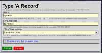
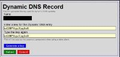

#failoverdns

Failover DNS for nodeping and cloudflare

It is easy to run your website on different servers. 
It is easy to run databases accross different servers. 
Because virtual servers got quite cheap. 
But it is not that easy to ensure that your visitors are visiting a server that is still running.

You can setup more than one A record but a lot of browsers do not support DNS load balancing.
You can setup a load balancer but then you just moved the problem to another place. You load balancer is now the single point of failure.

For me DNS looks like a good solution to point visitors to the right server.
But I want to start with a low effort and simple solution.

So lets start with the first step into DNS failover.

## Create a DNS server account which is supporting dynamic DNS updates
For me HE.NET is offering a cheap ($0.00) and reliable DNS service.
If you add an A record you can select that this record can be dynamically updated through a script:


TTL (time to live) for this can be setup to up to 5 minutes.
After the creation you have to click on the arrows on the right side to add your access key.


This will be your password to update the A record. [The values are not real - so don't try them.]

Best addon it is working for AAAA (IPv6!) too:


The update of the ip is simple:
```
curl "https://dyn.dns.he.net/nic/update?hostname=dyn.example.com&password=password&myip=192.168.0.1"
curl "https://dyn.dns.he.net/nic/update?hostname=dyn.example.com&password=password&myip=2001:db8:beef:cafe::1"
```
Just use curl to call a url.

## Write a short bash script that is managing everything
So what do we need?
- A textfile containing ip addresses of the web servers
- A way to check which servers are online
- A call to HE.NET to update the DNS A record

I am using just bash, curl and dig.
Dig ist part of the dnsutils and can be installed through following command:
```
sudo apt-get install dnsutils
```

After that we can create the file containing the ips:
```
nano ~/ips
```
Content:
```
127.0.0.1
186.0.0.1
10.1.1.1
```

So one ip per line. I am using the order to priorize the servers because the script is taking the first usable ip to update the DNS record.

## get script
```
wget -O dnsupdate https://raw.githubusercontent.com/wlanboy/failoverdns/refs/heads/master/dnsupdate
chmod +x ~/dnsupdate
```

## crontab
Last step is creating a cron job calling this script every 5 minutes:
```
crontab -e
```

Add line:
```
/5 * * * * /usr/bash ~/dnsupdate
```

## Next step is to add CloudFlare support.
First thing you need is the API-KEY, which can be found on the buttom of your Account information.

The API itself is easy, but is using JSON.
So we need some Ruby magic to get this done.
see: https://github.com/wlanboy/failoverdns/blob/master/dnsupdate.rb

## Cloudflare API
list domains and records
```
curl https://www.cloudflare.com/api_json.html \
-d 'a=rec_load_all' \
-d 'tkn=[Your API_TOKEN]' \
-d 'email=[Your CloudFlare login]' \
-d 'z=[domain to update]'
```

update domain
```
curl https://www.cloudflare.com/api_json.html \
  -d 'a=rec_edit' \
  -d 'tkn=[Your API_TOKEN]' \
  -d 'id=[DB ID of the record you want to update]' \
  -d 'email=[Your CloudFlare login]' \
  -d 'z=[Domain of record]' \
  -d 'type=A' \
  -d 'name=[Name of record to update]' \
  -d 'content=[new ip address]' \
  -d 'service_mode=1' \
  -d 'ttl=1' \
```
TTL is the time to live of record in seconds. 1 is the value for the "Automatic" setting.

## Install libs
```
sudo apt-get install dnsutils curl jq
```
